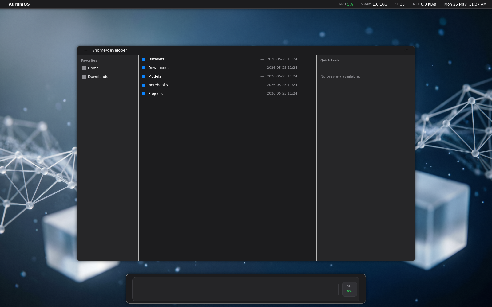

<div align="center">

# AurumOS

**The Linux distribution for AI engineers.**
Production-grade · macOS-Sequoia-class UX · adapts to your hardware.

[](LICENSE)
[](VERSION)
[](https://github.com/AntonioBurgos91/aurum-os/actions/workflows/ci.yml)
[](https://github.com/AntonioBurgos91/aurum-os/stargazers)
[](https://github.com/AntonioBurgos91/aurum-os/commits/main)
[](https://github.com/AntonioBurgos91/aurum-os)
[](https://github.com/AntonioBurgos91/aurum-os)
[](https://github.com/AntonioBurgos91/aurum-os/issues)

[](docs/guides/sota-2026-stack.md)
[](docs/guides/hardware-profiles.md)
[](CMakeLists.txt)
[](daemons/)
[](desktop/)



</div>

---

## Why this exists

Every AI engineer hits the same wall on day one of a fresh Linux install: hours
of `pip install`, broken CUDA, a stack that's six months behind, and a desktop
environment that wasn't designed by anyone who's ever fine-tuned a model.

**AurumOS solves that.** It's a Linux distribution that ships the 2026 AI stack
you actually need (vLLM, Unsloth, DSPy, Continue.dev, ComfyUI, Langfuse, MCP,
+ 30 more), wires it all into a macOS-Sequoia-inspired desktop built from
scratch in Qt6/QML, and **auto-adapts to your hardware** — from a CPU-only
laptop to a dual-GPU workstation, the defaults always make sense.

Forked from **Pop!_OS 24.04 LTS** to inherit its battle-tested NVIDIA / CUDA
story, then layered with:

- A bespoke **Qt6/QML desktop environment** (9 native apps, 12 shared QML components, 3 Rust daemons exposed via D-Bus)
- A pinned **Hyprland compositor fork** tuned to never steal frames from a training run
- A **curated SOTA-2026 AI stack** (PyTorch 2.12, vLLM, Unsloth, DSPy, Continue.dev, Langfuse, ComfyUI, Whisper, …)
- A **hardware profile detector** that picks model sizes, VRAM flags, and quantization defaults so your tools "just work"
- A **Model Pack Manager** (Steam-Workshop-style) for one-click downloads of curated model bundles

---

## At a glance

|  |  |
|---|---|
| **Lines of code** | ~50K (C++23, Rust, QML, Python, Bash) |
| **QML components** | 12 reusable (Aurum.Aqua module) |
| **Desktop apps** | 9 native + 3 Rust daemons |
| **AI install scripts** | 8 profile-adaptive installers |
| **Ready-to-run recipes** | 35+ (DSPy, Unsloth, Axolotl, ComfyUI workflows, …) |
| **Model packs** | 6 (Coding · Vision · Chat · ImageGen · Speech · Workstation) |
| **File-type icons** | 170 SVG (Finder MIME-aware, ~85 fdo MIME-name symlinks) |
| **User guides** | 20+ Markdown guides + 7 ADRs |
| **CI checks** | 5 stages (shell · cpp · rust · build · smoke) + 52-check smoke harness |

---

## The differentiator: hardware-tier adaptive

Most "AI distros" assume you have an H100. AurumOS doesn't.

On first boot, [`aurum-detect-profile`](distro/post-install/00-detect-profile.sh)
reads `nvidia-smi` + `/proc/meminfo` and writes
`/etc/aurum/profile.conf` — every launcher (`aurum-launch-vllm`,
`aurum-launch-comfyui`, `aurum-finetune`, …) sources this file and adapts.

| Profile | VRAM | RAM | Example GPU | Ollama default | vLLM | ComfyUI |
|---------|------|-----|-------------|----------------|------|---------|
| **lite** | 0 / iGPU | 8-16 GB | Laptops without NVIDIA | `qwen2.5:0.5b`, `gemma2:2b` | _skip_ | _skip_ |
| **standard** ⭐ | 6-12 GB | 16-32 GB | **RTX 5060 / 4060 / 3060** | `qwen2.5-coder:7b` | AWQ @ 8K | `--medvram` SDXL-Turbo |
| **pro** | 12-16 GB | 32-64 GB | RTX 5060 Ti / 5070 / 4070-Ti | `qwen2.5-coder:14b` | AWQ @ 16K | `--highvram` SDXL |
| **workstation** | 24 GB+ | 64 GB+ | RTX 4090 / 5090 / A6000 | `qwen2.5-coder:32b`, `llama3.3:70b-q4` | tensor-parallel | Flux.1-dev |

Override any time: `AURUM_PROFILE=pro aurum-detect-profile`.

---

## The SOTA 2026 AI stack

Every tool below ships in the ISO and is wired into the desktop (dock icon +
launcher script + Hyprland window rule + .desktop entry). The full matrix
showing what each profile installs is in
[`docs/guides/sota-2026-stack.md`](docs/guides/sota-2026-stack.md).

| Category | Tools |
|----------|-------|
| **Training** | PyTorch 2.12 · JAX 0.10 · TensorFlow 2.21 |
| **LLM inference** | Ollama · vLLM · SGLang · TGI · llama.cpp |
| **LLM proxy** | LiteLLM (`:4000`) — one OpenAI-compatible API for cloud + local models |
| **Fine-tuning** | Unsloth (QLoRA 4-bit) · Axolotl · TorchTune · DeepSpeed · peft · trl |
| **Quantization** | bitsandbytes · AutoGPTQ · AutoAWQ · optimum |
| **Modern LLM workflows** | DSPy · Instructor · Outlines · Guidance · Pydantic AI · MCP (Python + TypeScript templates) |
| **AI-augmented coding** | Continue.dev (pre-wired to local Ollama) · Aider · Claude Code CLI |
| **Observability + eval** | Langfuse self-hosted (`:3030`) · Phoenix · TruLens · Ragas · DeepEval |
| **Computer vision** | YOLOv11 · SAM 2 · DINOv2 · OpenCLIP · MediaPipe |
| **Multimodal** | LLaVA · InternVL2 · Qwen2-VL |
| **Image generation** | ComfyUI w/ SDXL-Turbo · Flux.1-dev · ControlNet workflows |
| **Speech** | faster-whisper · Piper TTS |
| **ML lifecycle** | MLflow · JupyterLab · Marimo · TensorBoard |
| **Dev tools** | VSCode (Wayland) · kitty · uv · Inter + JetBrains Mono typography |

### Model Pack Manager

ISO ships under 8 GB — models are downloaded post-install via a
Steam-Workshop-style GUI (**Settings → Model Packs**) or the CLI:

```bash
aurum-model-pack list                  # show all 6 packs with state + size
aurum-model-pack install coding        # qwen2.5-coder:7b + 14b + nomic-embed-text  (12 GB)
aurum-model-pack install vision        # YOLOv11s + SAM 2 + DINOv2 + CLIP            ( 3 GB)
aurum-model-pack install chat          # qwen2.5:7b + llama3.2:3b                    ( 6 GB)
aurum-model-pack install imagegen      # SDXL-Turbo + ControlNet                     ( 8 GB)
aurum-model-pack install speech        # Whisper + Piper voices                      ( 2 GB)
aurum-model-pack install workstation   # Llama-3.3-70b + Flux.1-dev (24 GB+ only)    (55 GB)
```

---

## The desktop

Nine native Qt6/QML apps sharing a single `Aurum.Aqua` module for visual
consistency. Built from scratch — no GNOME / KDE / XFCE inheritance.

| App | Role |
|-----|------|
| **dock** | Bottom dock with macOS-style magnification, 12 default icons |
| **menubar** | Top strip with live GPU util / VRAM / temp / NET / clock applets |
| **finder** | File manager with ML sidebar + Quick Look for `.ipynb` / `.safetensors` / `.parquet` |
| **spotlight** | ⌘-Space overlay with 5 in-process plugins (apps · files · calc · web · ML jobs) |
| **mission-control** | Workspace + window grid via Hyprland IPC |
| **notifications** | Top-right stack |
| **settings** | 8 panels: General · GPU · CUDA · Python venvs · MLOps · **Hardware** · **Model Packs** · About |
| **installer** | Live-ISO wizard wrapping `distinst` |
| **coming-soon** | Lightweight placeholder for not-yet-built apps |

Plus three **Rust daemons** on the session bus:

- **`aurum-gpu-monitor`** — NVML → D-Bus telemetry (GPU util, VRAM, temp)
- **`aurum-spotlight-indexer`** — tantivy + inotify file index
- **`aurum-ml-jobs-tracker`** — MLflow REST → D-Bus event stream

### Visual identity (Wave 10)

- **Typography** — Inter (OFL substitute for SF Pro Display/Text) · JetBrains Mono for code
- **Unified window chrome** — single `WindowChrome.qml` with 3 traffic lights (close/min/max), draggable header, hairline divider — used by every app
- **Consistent settings rhythm** — every panel built from `SectionCard` components (12 px radius, 16 px padding, hairline border, 16 px between cards)
- **Procedural wallpapers** — Rust + tiny-skia generates 6 Sequoia-style wallpapers (`aurum-amber`, `aqua`, `obsidian`, `dawn`, `aurora`, `void`)
- **Selective animations** — 150 ms fade only on window open/close + Spotlight; workspaces/borders/layout stay instant so DL training sees zero compositor variance ([ADR-0006](docs/adr/0006-selective-animations.md))
- **Cursors** — macOS-BigSur theme via `XCURSOR_THEME` env in compositor config
- **File-type icons** — 170 SVG covering Python, Jupyter, PyTorch checkpoints, Parquet, ONNX, GGUF, safetensors, … + 34 menubar applet glyphs (battery 5-state, WiFi 5-state, Bluetooth, volume, brightness, GPU, VRAM, thermometer, network, clock, keyboard)

---

## Architecture

```
   ┌────────────────────────────────────────────────────────────┐
   │  Qt6/QML apps  (dock · menubar · finder · spotlight · …)   │
   │              shared module: Aurum.Aqua (12 components)     │
   └──────┬──────────────────────────────────────┬──────────────┘
          │                                      │
   ┌──────▼───────────┐                  ┌───────▼──────────┐
   │   libs/aqua-qt    │                  │  libs/core-      │
   │   Theme tokens   │                  │  services        │
   │   (colors, type) │                  │  ProfileClient   │
   └──────────────────┘                  │  LaunchService   │
                                         └───────┬──────────┘
                                                 │
   ┌─────────────────────────────────────────────▼──────────┐
   │             session D-Bus                              │
   │  org.aurumos.GpuMonitor   .SpotlightIndexer            │
   │                          .MlJobsTracker                │
   └──┬──────────────────┬───────────────┬──────────────────┘
      │                  │               │
   ┌──▼────────┐  ┌──────▼─────┐  ┌──────▼──────┐
   │ gpu-mon   │  │ spotlight- │  │ ml-jobs-    │   ← Rust daemons
   │ NVML      │  │ indexer    │  │ tracker     │
   │           │  │ tantivy    │  │ MLflow REST │
   └───────────┘  └────────────┘  └─────────────┘
                                                  
   ┌────────────────────────────────────────────────────────┐
   │  Hyprland compositor fork  (wlroots + drm/kms)         │
   │  + conf.d/ drop-ins per Wave 8/9/10 (no main collision)│
   └────────────────────────────────────────────────────────┘
                                                  
   ┌────────────────────────────────────────────────────────┐
   │ Pop!_OS 24.04 LTS base · NVIDIA driver · CUDA · cuDNN  │
   └────────────────────────────────────────────────────────┘
```

See [`docs/architecture.md`](docs/architecture.md) for the full diagrams.

---

## Quickstart

### 1. Try it without installing (Docker preview, ~10 min)

```bash
git clone https://github.com/AntonioBurgos91/aurum-os.git
cd aurum-os
distro/demo/run-preview.sh             # NVIDIA host: spins up the desktop in a noVNC iframe
# → http://localhost:6080/vnc.html?resize=scale
```

The preview renders on **AMD / Intel** GPUs too (DRM passthrough), not just
NVIDIA. `run-preview.sh` targets an NVIDIA host; on an AMD/Intel box build the
images and pass the render nodes directly:

```bash
docker build -t aurumos:dev .
docker build -t aurumos:desktop -f distro/demo/Dockerfile.desktop .

docker run -d --name aurum-desktop \
  --device /dev/dri/card1 --device /dev/dri/renderD128 \
  --group-add "$(stat -c '%g' /dev/dri/renderD128)" \
  --group-add "$(stat -c '%g' /dev/dri/card1)" \
  --tmpfs /run:rw,mode=0755 -p 6080:6080 -p 5900:5900 \
  -e GPU_BACKEND=drm -e QT_ICON_THEME=Papirus \
  aurumos:desktop
# → http://localhost:6080/vnc.html?resize=scale
```

No GPU at all? Add `-e GPU_BACKEND=headless` for the software (pixman) renderer.

### 2. Install the SOTA stack on an existing Pop!_OS / Ubuntu 24.04 host

```bash
sudo bash distro/post-install/00-detect-profile.sh         # writes /etc/aurum/profile.conf
sudo bash distro/post-install/05-install-quantization.sh   # bitsandbytes + GPTQ + AWQ
sudo bash distro/post-install/06-install-finetuning.sh     # Unsloth + Axolotl + DeepSpeed
sudo bash distro/post-install/07-install-llm-serving.sh    # vLLM + LiteLLM + SGLang
sudo bash distro/post-install/08-install-llm-workflows.sh  # DSPy + Instructor + MCP
sudo bash distro/post-install/09-install-ai-coding.sh      # Continue.dev + Aider + Claude Code
sudo bash distro/post-install/10-install-observability.sh  # Langfuse + Phoenix
sudo bash distro/post-install/11-install-cv-multimodal.sh  # YOLOv11 + SAM 2 + ComfyUI
sudo bash distro/post-install/12-install-model-pack-manager.sh

aurum-model-pack install coding        # download your first model bundle
```

### 3. Build a fresh AurumOS ISO from scratch (~2-3 h)

```bash
sudo distro/iso-builder/build.sh -o build/aurumos.iso
# → bootable hybrid USB/UEFI ISO, ~7 GB, everything above pre-installed
```

### 4. Develop on the desktop itself

```bash
docker build -t aurumos:dev .
docker run --rm -it -v $(pwd):/workspace aurumos:dev bash

# inside the container
cmake -S . -B build -DCMAKE_BUILD_TYPE=Release
cmake --build build -j$(nproc)
```

---

## Verification

A per-domain test suite runs from the source tree:

```bash
bash tests/run-wave-8-9-smoke.sh
```

Categorised PASS/FAIL summary across hardware-profile detection,
Model Pack CLI, LLM workflow imports, AI-coding tools, observability libs,
and CV/multimodal stack.

Acceptance criteria for `v0.2.0-beta`:

- [`tests/boot_bench.sh`](tests/boot_bench.sh) — boot ≤ 3 s
- [`tests/idle_bench.sh`](tests/idle_bench.sh) — idle RAM ≤ 600 MB
- [`tests/dl_smoke.py`](tests/dl_smoke.py) + [`tests/dl_bench.py`](tests/dl_bench.py)
- [`tests/acceptance.sh`](tests/acceptance.sh) — all of the above + JSON report

For the **live-container smoke harness** (52 checks against a running preview):

```bash
./tools/smoke-test.sh                  # human-readable
./tools/smoke-test.sh --json           # CI-friendly
```

---

## CI

[](.github/workflows/ci.yml)

Every push and PR triggers GitHub Actions on `ubuntu-24.04` runners:

| Stage | Check |
|-------|-------|
| **lint-shell** | `shellcheck -S warning` across every tracked `*.sh` |
| **lint-cpp** | `clang-format --dry-run --Werror` against `desktop/` + `libs/` |
| **lint-rust** | `cargo fmt --check` + `cargo clippy -D warnings` for every crate |
| **build-cpp** | Release Qt6/CMake build + `ctest --output-on-failure` |
| **build-rust** | Release builds + `cargo test` with `Swatinem/rust-cache` |
| **smoke** | Boots `distro/demo/Dockerfile.desktop` and runs the 52-check `tools/smoke-test.sh`; uploads `smoke-output.json` |

Tagging `v*` triggers [`.github/workflows/release.yml`](.github/workflows/release.yml),
which builds the ISO, computes `SHA256SUMS`, and publishes a draft Release.

Optional pre-commit hooks (`shellcheck`, `clang-format`, `cargo fmt`,
trailing-whitespace, large-file guard) via [`.pre-commit-config.yaml`](.pre-commit-config.yaml).

---

## Tech stack

**Languages** · C++23 · Rust · QML · Python 3.12 · Bash
**Frameworks** · Qt 6 · CMake · tokio · zbus · tantivy · tiny-skia
**Compositor / display** · Hyprland (forked) · wlroots · Wayland · wayvnc · websockify · noVNC
**AI / ML** · PyTorch · JAX · TensorFlow · vLLM · SGLang · TGI · Ollama · llama.cpp · Unsloth · Axolotl · DeepSpeed · TorchTune · peft · trl · bitsandbytes · AutoGPTQ · AutoAWQ · DSPy · Instructor · Outlines · Guidance · Pydantic AI · MCP · LiteLLM · Continue.dev · Aider · Claude Code · MLflow · TensorBoard · JupyterLab · Marimo · Langfuse · Phoenix · TruLens · Ragas · DeepEval · YOLOv11 · SAM 2 · DINOv2 · OpenCLIP · ComfyUI · diffusers · faster-whisper · Piper
**Distro / infrastructure** · Pop!_OS 24.04 LTS · NVIDIA driver · CUDA · cuDNN · TensorRT · APT · uv · systemd · D-Bus · Docker · xorriso · mksquashfs · distinst

---

## Roadmap

| Wave | Status | Scope |
|------|:------:|-------|
| 1 | ✅ | Compositor fork + desktop skeleton |
| 2 | ✅ | 9 QML apps + 3 Rust daemons + D-Bus bus |
| 3 | ✅ | Finder ML sidebar + Quick Look |
| 4 | ✅ | DL stack (PyTorch / JAX / TF / Ollama / MLflow) |
| 5 | ✅ | Live demo container + screenshots |
| 6 | ✅ | Installer wrapping `distinst` + acceptance harness |
| 7 | ✅ | Make-it-actually-work-as-a-DL-workstation (VSCode, kitty, terminal launchers) |
| 8 | ✅ | **SOTA 2026 stack** — vLLM · Unsloth · DSPy · Continue.dev · Langfuse · ComfyUI · MCP |
| 9 | ✅ | **Model Pack Manager** — GUI panel + CLI + 6 manifests |
| 10 | ✅ | **Visual polish** — WindowChrome · Inter typography · SectionCard · wallpaper generator · selective animations |
| 11 | ⏳ | Lock screen · login manager · Plymouth boot · OSDs · ⌘-Tab · system tray applets (battery, WiFi, BT, volume, brightness) |
| 12 | ⏳ | Benchmark suite + comparison harness (vs Ubuntu, Pop!_OS, Lambda Stack) |
| 13 | ⏳ | Production hardening — signed ISOs · APT repo · crash reporter opt-in · i18n |
| 14 | ⏳ | Launch — landing site · docs site · demo video · comparison matrix |

**Recent (post-Wave 10):**

- ✅ **Hardware-agnostic preview** — the noVNC desktop now renders on AMD APUs,
  Intel iGPUs and NVIDIA via `/dev/dri` passthrough, not just NVIDIA. Fixed the
  empty-dock (missing icon theme + `.desktop` staging), the `QT_ICON_THEME`
  override being ignored, and off-screen dock positioning on multi-output hosts.
- ✅ **CPU-only install path** — `jax` / `tensorflow-cpu` instead of the CUDA
  wheels, NVIDIA-repo step guarded behind a GPU check, relocatable shared venv.
- ✅ **Working dock launchers** — clicking a dock icon now actually opens the
  app. Default favorites resolve to `aurum-launch-*` wrapper scripts that probe
  for a real app and degrade gracefully when one isn't installed. The preview
  ships a Wayland-native terminal (foot), a Qt browser (falkon) and a fallback
  editor (nano), so Terminal / Browser / Editor work out of the box.
- 🆕 New default wallpaper.

**Still rough / known gaps:**

- Menubar GPU/VRAM/temp applets show **simulated** telemetry when no NVML
  device is present (the daemons run in simulation mode — values aren't real).
- Notebook / LLM dock icons (JupyterLab, Marimo, Ollama) need their backing
  tool installed (`pip install jupyterlab marimo`, `ollama` from ollama.com);
  until then the launcher shows a notification instead of failing silently.
- The browser launcher uses falkon, whose window class is `org.kde.falkon`, so
  the dock's activate-or-launch dedup doesn't yet recognise an already-open
  browser window (minor: a second click opens a second window).

Per-wave detail in [`CHANGELOG.md`](CHANGELOG.md).

---

## Engineering notes

A few design decisions worth highlighting:

- **Hardware-profile detection runs on every boot** via a systemd oneshot, so swapping a GPU is detected automatically and every launcher picks up new defaults.
- **No app modifies `aurum.conf` directly**. Window rules, env vars, and animation policy live in `distro/hyprland-fork/conf.d/` drop-ins, sourced by the main config. This pattern eliminated cross-feature collisions early in development.
- **Selective animations** (150 ms fade, window-open/close only) emerged after measuring that `animations { enabled = false }` was being silently overridden by drop-ins — and that the original "all-off" decision had been overcorrecting for a problem that doesn't fire during steady-state training.
- **The Model Pack CLI uses a line-buffered text protocol** (`PROGRESS:<id>:<pct>`, `DONE:<id>`, `ERROR:<id>:<msg>`) so the Qt GUI parses `QProcess` stdout directly — no JSON-RPC, no D-Bus, just a stable contract documented at the top of both files.
- **The QML `WindowChrome` component exposes its tunables as component properties**, not as Theme tokens, so every app can have a different header height without polluting a global namespace. Only truly cross-cutting design tokens (font sizes, accent colors, card radii) live in `Theme.qml`.
- **All 60+ file-type icons are pure-SVG with no external `<image href>`** — they parse in headless Qt builds without dragging a rasteriser.

---

## ⭐ Star History

<a href="https://star-history.com/#AntonioBurgos91/aurum-os&Date">
 <picture>
   <source media="(prefers-color-scheme: dark)" srcset="https://api.star-history.com/svg?repos=AntonioBurgos91/aurum-os&type=Date&theme=dark" />
   <source media="(prefers-color-scheme: light)" srcset="https://api.star-history.com/svg?repos=AntonioBurgos91/aurum-os&type=Date" />
   
 </picture>
</a>

---

## 🤝 Contributing

AurumOS is an honest beta — actively looking for contributors who want to push it toward v1.0.

**Especially interested in:**

- 🧪 **Benchmark results** on different hardware tiers (lite / standard / pro / workstation)
- 🛠️ **Missing tools** from the SOTA 2026 stack you'd want shipped by default
- 🐛 **Bug reports** from the live preview container — `distro/demo/run-preview.sh`
- 🎨 **Theme contributions** — new procedural wallpapers, icon variants, accent colors
- 📦 **Model Pack manifests** — propose a new curated bundle
- 🌍 **i18n** — Spanish, French, German, Japanese translations welcome
- 📝 **Documentation** — guides for specific use cases (RAG dev setup, multi-GPU training, etc.)

**Getting started:**

1. Browse [open issues](https://github.com/AntonioBurgos91/aurum-os/issues) or open a new one
2. Read [`CONTRIBUTING.md`](CONTRIBUTING.md) for the workflow
3. Try the [live preview](distro/demo/run-preview.sh) before proposing changes
4. PRs welcome — small fixes get merged fast

**No CLA required.** Just contribute under the GPL-3.0 license.

---

## License

AurumOS is **GPL-3.0-or-later**. Full text in [`LICENSE`](LICENSE), with a
Debian-style [`COPYING`](COPYING) symlink for packaging. This license is
required for compatibility with upstream Pop!_OS desktop components that
several AurumOS apps derive from.

- **Inter** — © 2016-2024 The Inter Project Authors (SIL OFL 1.1)
- **JetBrains Mono** — © JetBrains s.r.o. (SIL OFL 1.1)
- **WhiteSur GTK theme** — © Vinceliuice (GPL-3.0)
- **macOS-BigSur cursors** — © ful1e5/apple_cursor (GPL-3.0)
- **Hyprland** — © Hyprland contributors (BSD-3-Clause)

---

<div align="center">

**AurumOS** · the AI engineer's Linux desktop ·  [docs](docs/) · [issues](https://github.com/AntonioBurgos91/aurum-os/issues) · [discussions](https://github.com/AntonioBurgos91/aurum-os/discussions)

[](https://github.com/AntonioBurgos91/aurum-os/stargazers)
[](https://github.com/AntonioBurgos91)

</div>
