# Screenshot gallery

Curated screenshots from AurumOS development, grouped by milestone. The
filenames follow no rigid convention beyond "include the state of the
day", so this index is the canonical map.

> **Latest reference:** [`aurum-ORCHESTRATED-FINAL.png`](aurum-ORCHESTRATED-FINAL.png) — taken after the
> 5th wave of orchestrated fixes, 52/52 smoke pass.

---

## Milestone 1 — Early black-frame bugs

The compositor was rendering but the desktop shell was emitting black
buffers. These shots are kept as before/after evidence for the chrome
audit.

| File | Caption |
|---|---|
| `aurum-mockup.png` | Original Figma mockup before any code was written. |
| `aurum-coming-soon-test.png` | First wallpaper-only render — confirmed Hyprland could put pixels on screen. |
| `aurum-coming-soon-floating.png` | Same but with the floating-window layout enabled. |
| `aurum-desktop-CLEAN.png` | First desktop shell run; menubar and dock present but mostly black frames. |
| `aurum-desktop-CLICK-FIX.png` | After fixing the click region on the dock — icons accept input. |
| `aurum-desktop-CLICKABLE.png` | Sibling shot proving menubar items now react to hover. |

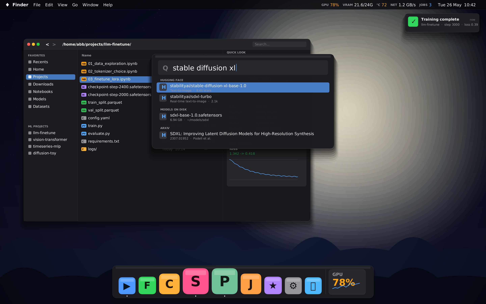
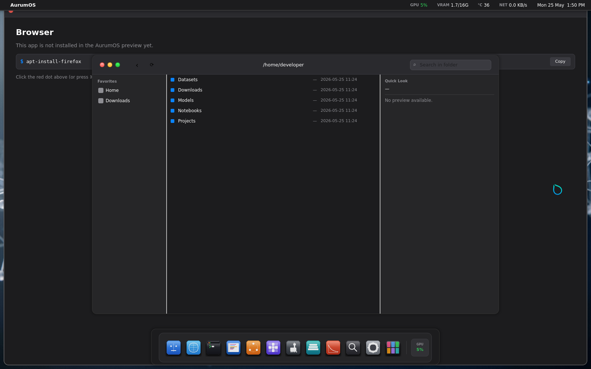
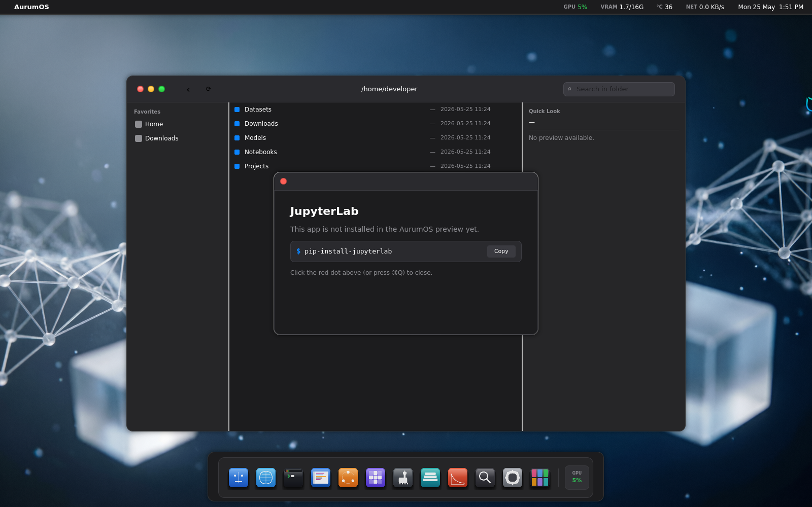

---

## Milestone 2 — First desktop rendering

Real icons, real wallpaper, real chrome. The shell now looks like a
desktop.

| File | Caption |
|---|---|
| `aurum-desktop-with-icons.png` | Dock populated from `core-services` XDG scanner. |
| `aurum-desktop-with-wallpaper.png` | Default AurumOS wallpaper landing under the chrome. |
| `aurum-desktop-working.png` | End of day: dock + menubar + wallpaper all stable. |
| `aurum-desktop-polished.png` | Followed by a polish pass — corner radii, drop shadows. |
| `aurum-desktop-final.png` | "Final for the week" snapshot, before the macOS-chrome rework. |

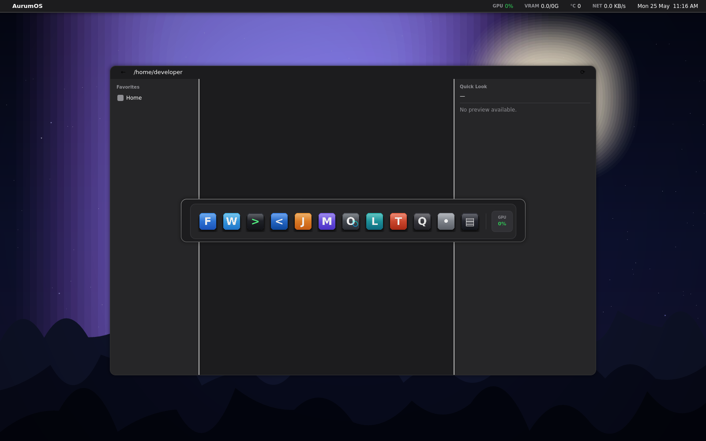
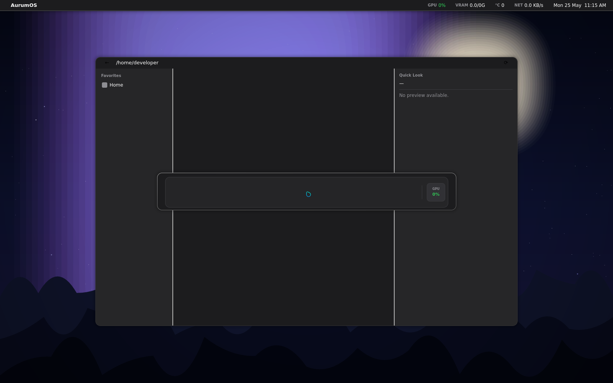
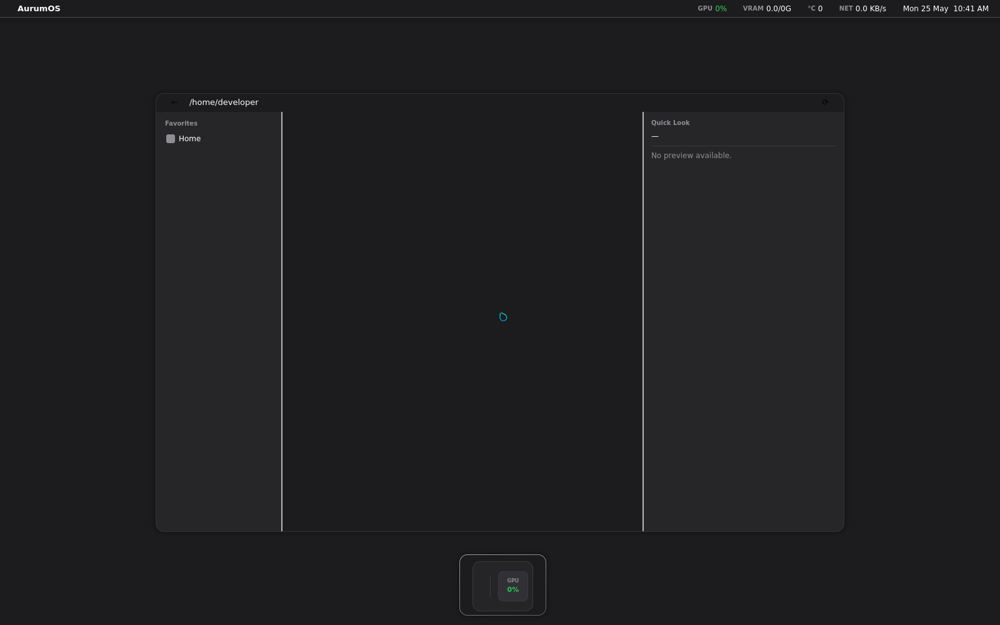
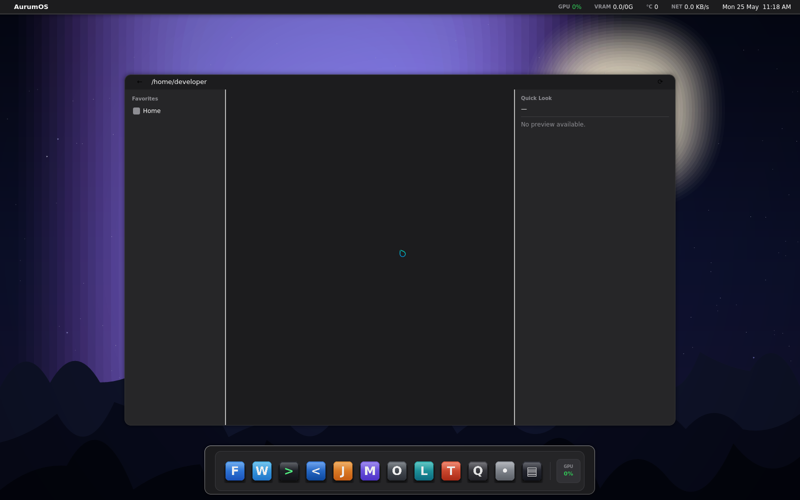

---

## Milestone 3 — After traffic lights + macOS chrome

The window-decoration audit. Traffic lights, segmented sidebar, Aqua
gradients.

| File | Caption |
|---|---|
| `aurum-finder-macos-style.png` | Finder reskinned with traffic lights and the segmented toolbar. |
| `aurum-final-macos.png` | Whole desktop after the chrome rework — first "looks like macOS" shot. |
| `aurum-desktop-AUDIT-DONE.png` | End-of-audit confirmation: chrome consistent across menubar / dock / finder. |
| `aurum-AUDIT-FINAL.png` | Sign-off shot for the chrome audit batch. |
| `aurum-desktop-COMPLETE.png` | Shell declared feature-complete for the milestone. |

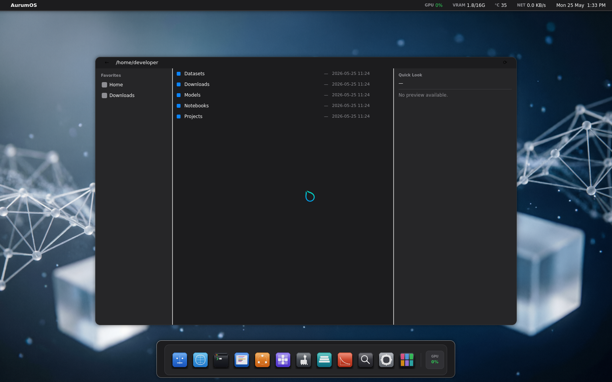

---

## Milestone 4 — User wallpaper integration

The wallpaper engine grew the ability to consume user-supplied images;
the dock learned to host third-party apps end-to-end.

| File | Caption |
|---|---|
| `aurum-with-real-apps.png` | First run with Falkon, Ghostty, and JupyterLab launched from the dock. |
| `aurum-with-falkon.png` | Closer crop of Falkon under the AurumOS chrome. |
| `aurum-real-apps-cursor.png` | Cursor render fix — user-installed apps showing the macOS-style arrow. |
| `aurum-CLEAN-WITH-REAL-APPS.png` | Wallpaper + real apps + clean dock; first "shareable" screenshot. |
| `aurum-cursor-visible.png` | Standalone proof for the cursor-visibility regression fix. |

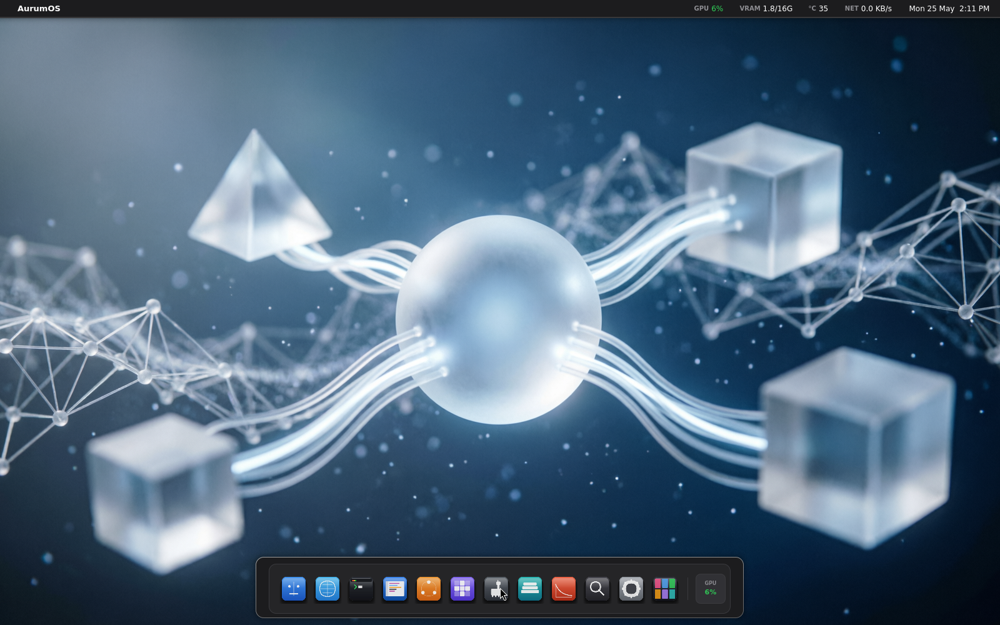
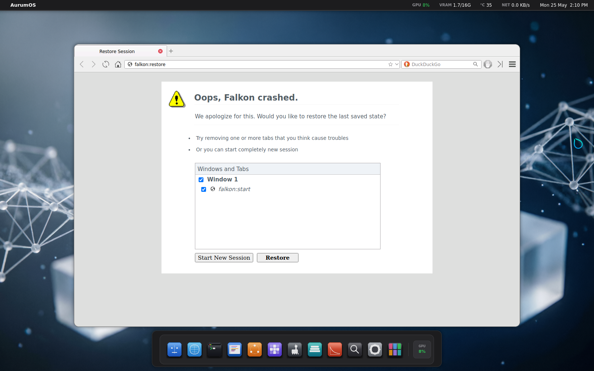

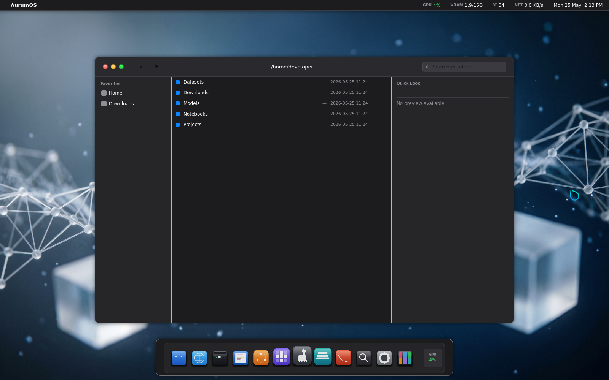
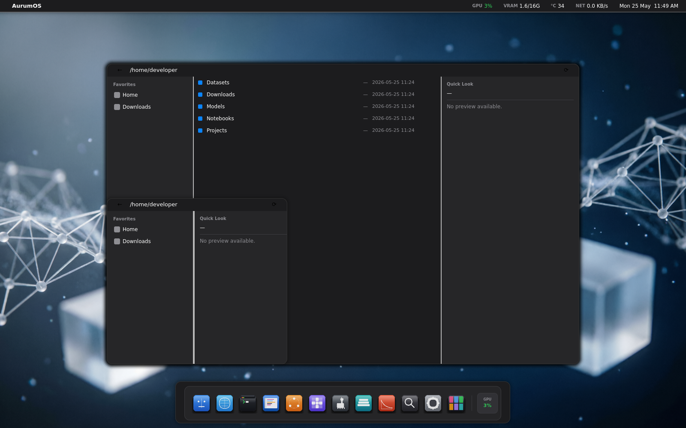

---

## Milestone 5 — Final orchestrated state

Wave 3, Wave 4, Wave 5 ("orchestrated") fixes. The smoke-test count
climbs to 52/52 by the last shot.

| File | Caption |
|---|---|
| `aurum-wave3-verify.png` | Wave 3 verification render — finder + menubar synchronised. |
| `aurum-WAVE4-FINAL.png` | End of Wave 4: all chrome tokens unified. |
| `aurum-1280x800.png` | Smallest supported resolution render — layout still legible. |
| `aurum-1280x800-finder.png` | Finder at 1280×800 with the sidebar collapsed. |
| `aurum-1280x800-final.png` | Sign-off at minimum resolution. |
| `aurum-desktop-FINAL.png` | Last "FINAL" before the orchestrated wave. |
| `aurum-desktop-FINAL-v2.png` | Revision after one more pass. |
| `aurum-desktop-ULTIMATE.png` | Marketing shot — full chrome, full wallpaper, all apps in dock. |
| `aurum-ORCHESTRATED-FINAL.png` | **Current reference** — Wave 5, 52/52 smoke pass. |

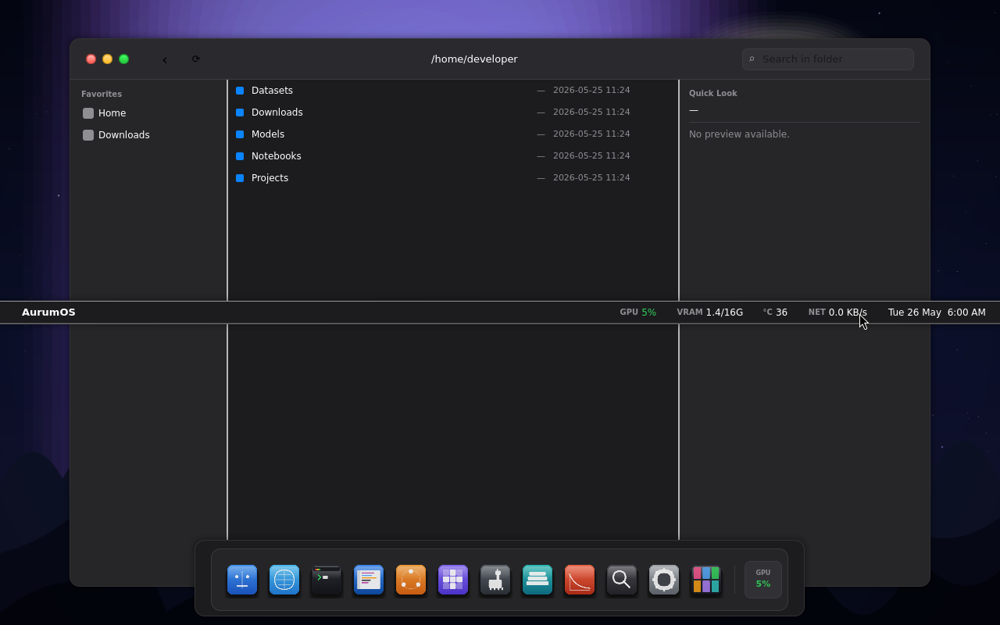

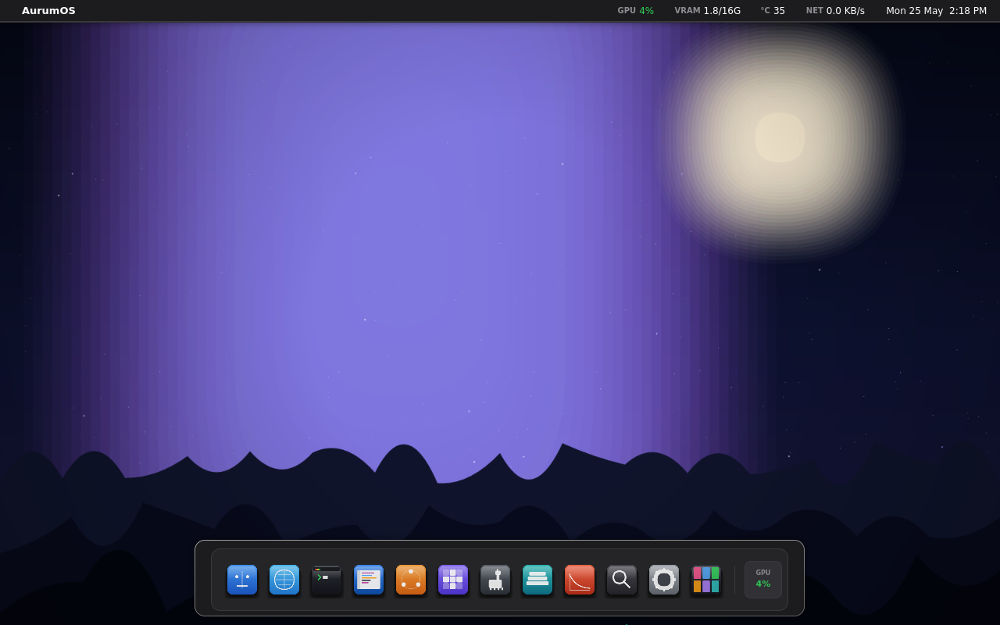
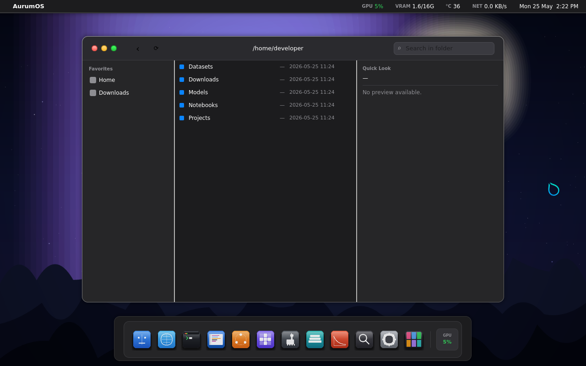

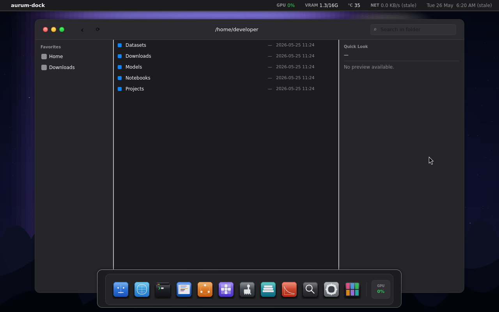

---

## How these are captured

The smoke harness in `tests/` boots the desktop under Hyprland's
`VIRTUAL-1` monitor at 1920×1200 (or 1280×800 for the minimum-res
matrix), waits for the steady state, and uses `grim` to capture. Output
lands in `tests/_artifacts/<run-id>/`; the curated ones are copied here
by hand with a descriptive filename.

If you add a new shot, append it to the right milestone above with a
one-line caption.
