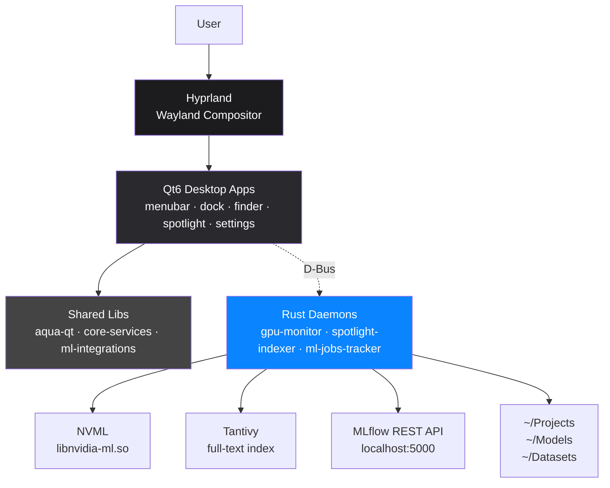
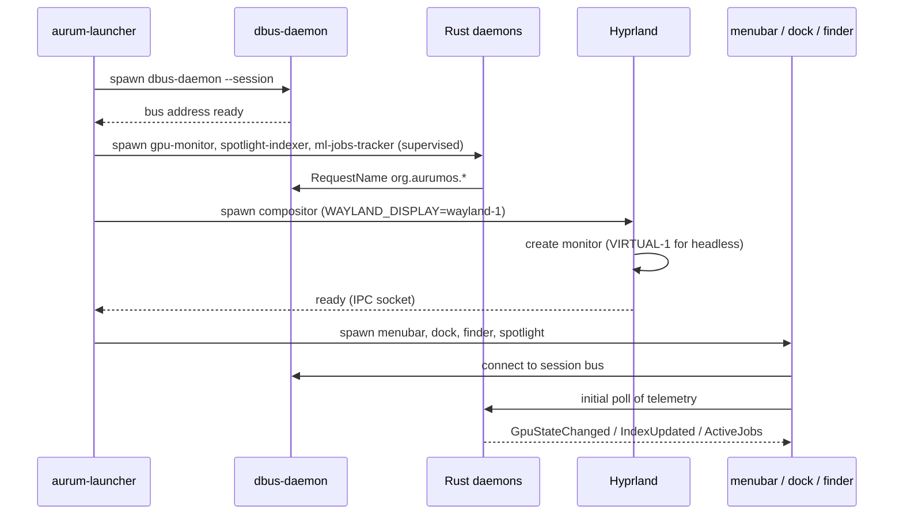
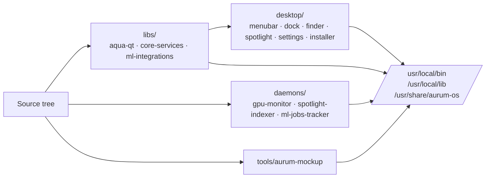

# AurumOS Architecture Overview

This document is a one-stop tour of how AurumOS fits together at runtime.
For the *why* behind each choice, follow the links to the ADRs in
[`adr/`](adr/). For per-component contracts, read the README in each
top-level directory.

---

## System overview

AurumOS is a five-layer stack:

1. **Pop!_OS 24.04 LTS** as the base — kernel, init, package manager, and
   hardware-enablement repos. We inherit Pop's NVIDIA driver packaging
   and kernel tunings.
2. **Hyprland** (pinned fork) as the Wayland compositor. We patch it for
   AurumOS-specific window decoration hooks and a virtual monitor for
   headless/CI runs.
3. **Qt6/QML desktop apps** — menubar, dock, finder, spotlight,
   mission-control, settings, installer. Each is a separate process; the
   shell is composed by `aurum-launcher` at session start.
4. **Rust daemons** exposing system data over the **session D-Bus** —
   GPU telemetry, file-system index, MLflow job state.
5. **Pre-installed deep-learning toolchain** — CUDA 12.3, PyTorch, JAX,
   TensorFlow, JupyterLab, Marimo, MLflow, Ollama, and the
   `aqua-ml-integrations` Quick Look handlers.

The layers are deliberately decoupled: the desktop apps don't link
against the daemons, the daemons don't know about Qt, and the deep-learning
stack runs in user space without any kernel-side patches.

---

## Top-level component diagram



- **Solid arrows** = direct linkage or process spawn.
- **Dotted arrows** = D-Bus method calls / signals.
- The user only touches the compositor; everything below is implementation.

See [`ADR-0002`](adr/0002-desktop-environment-architecture.md) for the
"why Qt6 + Hyprland + D-Bus" rationale.

---

## D-Bus signal flow

All three Rust daemons publish on the **session bus** (not system) under
the `org.aurumos.*` namespace. There is no shared broker — D-Bus *is* the
broker (see [`ADR-0002`](adr/0002-desktop-environment-architecture.md)).

```mermaid
graph LR
    subgraph DesktopProcesses[Desktop processes]
        Dock[dock<br/>GpuClient]
        Menubar[menubar<br/>GpuClient · MlClient]
        Spotlight[spotlight<br/>SearchClient]
        Finder[finder<br/>SearchClient]
    end

    subgraph SessionBus[Session D-Bus]
        Gpu[org.aurumos.GpuMonitorService<br/>GetGpuUtilization → u32<br/>GpuStateChanged signal]
        Idx[org.aurumos.SpotlightIndexerService<br/>Search(q,limit) → Vec&lt;Hit&gt;<br/>IndexUpdated signal]
        Jobs[org.aurumos.MlJobsTrackerService<br/>ActiveJobs() → Vec&lt;Job&gt;<br/>JobFinished signal]
    end

    Dock -- poll 1s --> Gpu
    Menubar -- poll 1s --> Gpu
    Menubar -- on signal --> Jobs
    Spotlight -- on-demand --> Idx
    Finder -- on-demand --> Idx
```

Polling cadence is bounded at 1 Hz to keep idle CPU under the budget in
[`ADR-0006`](adr/0006-performance-budget.md). The daemons fan-out is
free — D-Bus delivers a single method-call response to every subscriber.

---

## Process tree at boot

`aurum-launcher` is started by the user session (via the
`aurum-desktop.target` systemd user unit). It brings up everything else
in dependency order.



Supervision: if a daemon crashes, `aurum-launcher` restarts it with
exponential backoff (200 ms, 400 ms, 800 ms, …, capped at 30 s). The
desktop apps see the bus name disappear and re-poll on reconnection.

For headless CI runs (the smoke harness in `tests/`), Hyprland is asked
to create a `VIRTUAL-1` monitor at 1920×1200 and the launcher hooks the
screenshot pipeline.

---

## Build pipeline

The repository is a CMake superbuild plus two Cargo workspaces.



Order matters because the desktop apps link the `libs/` static archives
at compile time:

1. **`libs/`** builds first (`cmake --build build --target libs`). Pure
   C++23 + QML, no Qt-runtime dependency at link time.
2. **`desktop/`** builds against the staged `libs/`. Each app is a
   standalone Qt6 executable.
3. **`daemons/`** is `cargo build --workspace --release` — independent of
   the C++ tree, only shares D-Bus interface XML in
   `interfaces/`.
4. **`tools/aurum-mockup`** is another small Cargo crate used by the
   screenshot harness in `tests/`.
5. **`cmake --install`** lays everything under `/usr/local/bin`,
   `/usr/local/lib`, and `/usr/share/aurum-os/`. The deb package built
   by `distro/iso-builder/` consumes this prefix.

The ISO build (`distro/iso-builder/build.sh`) packages the result inside
a chroot of Pop!_OS, runs the numbered `distro/post-install/` scripts,
and emits a single bootable `.iso`.

---

## Where state lives

The desktop is designed so a fresh login or a `rm -rf ~/.config/aurum`
brings you back to defaults without breaking anything. State lives in a
small number of well-known places:

| Data                           | Location                                                                  | Format                          |
|--------------------------------|---------------------------------------------------------------------------|---------------------------------|
| User dock favourites           | `~/.config/aurum/dock.list`                                               | newline-separated app ids       |
| Settings (window, theme, etc.) | `~/.config/aurum/settings.ini`                                            | QSettings INI                   |
| MLflow client config           | `~/.config/aurum/mlflow.toml`                                             | TOML                            |
| Spotlight index                | `~/.cache/aurum/spotlight-index/`                                         | Tantivy directory               |
| Per-user CUDA env              | `~/.config/aurum/cuda.env`                                                | shell `KEY=VAL` lines           |
| Hyprland config (system)       | `/etc/aurum/hypr/aurum.conf`                                              | hyprlang                        |
| Hyprland config (user)         | `~/.config/hypr/hyprland.conf`                                            | hyprlang (overrides system)     |
| Theme palette                  | `libs/aqua-qt/qml/Aurum/Aqua/Theme.qml`                                   | QML readonly properties (compile-time) |
| Wallpapers                     | `/usr/share/backgrounds/aurumos/`                                         | PNG / JPG                       |
| Daemon logs                    | `journalctl --user -u aurum-<name>`                                       | systemd journal                 |

Notes:

- The theme palette is **compile-time** — there's no `themes.json` at
  runtime. Changing the palette means rebuilding `libs/aqua-qt`. This
  is intentional ([`ADR-0002`](adr/0002-desktop-environment-architecture.md)
  — runtime theming via QML imports was rejected for performance).
- The Tantivy index can always be rebuilt. If `~/.cache/aurum/` is on
  a tmpfs and you reboot, the indexer just re-scans `~/Projects`,
  `~/Models`, `~/Datasets` on next start.
- The `dock.list` is a list of `.desktop` IDs, *not* paths. Removing the
  underlying `.desktop` file leaves a tombstone that the dock skips
  gracefully.

---

## Further reading

- [`adr/0001-base-operating-system.md`](adr/0001-base-operating-system.md) — why Pop!_OS 24.04
- [`adr/0002-desktop-environment-architecture.md`](adr/0002-desktop-environment-architecture.md) — Qt6 + Hyprland + D-Bus
- [`adr/0003-package-management.md`](adr/0003-package-management.md) — apt + system venv layout
- [`adr/0004-memory-and-storage.md`](adr/0004-memory-and-storage.md) — disk + swap defaults
- [`adr/0005-installer-architecture.md`](adr/0005-installer-architecture.md) — `aurum-installer` design
- [`adr/0006-performance-budget.md`](adr/0006-performance-budget.md) — idle CPU / RAM caps
- [`adr/0007-release-process.md`](adr/0007-release-process.md) — version + tagging policy
- [`guides/install-baremetal.md`](guides/install-baremetal.md) — installing on real hardware
- [`guides/nvidia-driver-matrix.md`](guides/nvidia-driver-matrix.md) — picking the right driver
- [Screenshot gallery](../distro/demo/screenshots/README.md) — what the desktop looks like at each milestone
